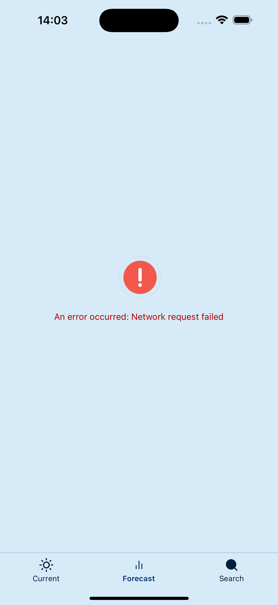
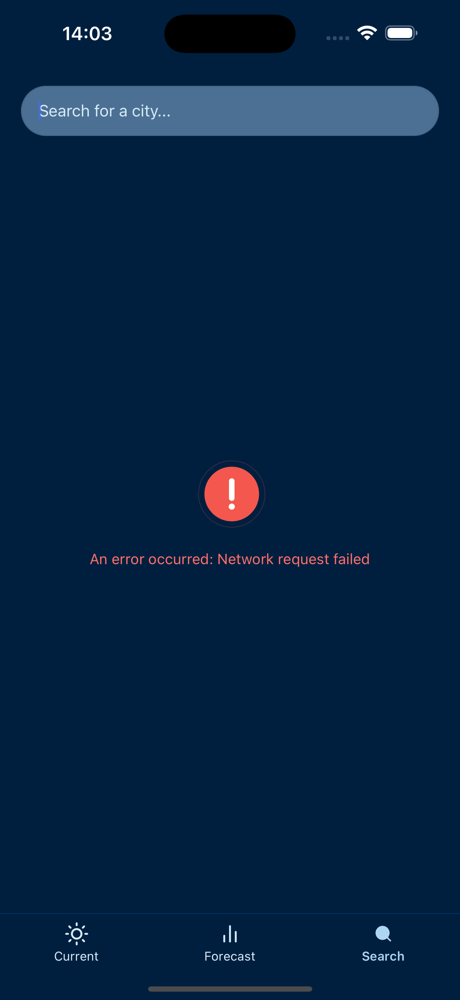

# Weather Forecast App

This is a simple weather forecast app built with React Native, Redux Toolkit, and TypeScript. It provides current weather information and a 5-day forecast for any city in the world. 
The app uses the OpenWeatherMap API for weather data and the Api-Ninjas for city autocomplete functionality.

### Screenshots

#### Light mode

| Status     | Current tab                                                       | Forecast tab                                                       | Search tab                                                       |
|------------|-------------------------------------------------------------------|--------------------------------------------------------------------|------------------------------------------------------------------|
| Functional |             |            |              |
| Error      |  |  |  |


#### Dark mode

| Status     | Current tab                                                      | Forecast tab                                                      | Search tab                                                      |
|------------|------------------------------------------------------------------|-------------------------------------------------------------------|-----------------------------------------------------------------|
| Functional |             |            |              |
| Error      |  |  |  |


### Videos

[Light mode](https://vimeo.com/1076668460/fe011662ad)
[Dark mode](https://vimeo.com/1076668432/e850c6c64c)

### Folder Structure and Architecture

#### Folder Structure
- **`src/stores/slices/`**: Contains Redux slices for managing application state. For example, `weatherSlice.ts` handles weather-related state, such as current weather, forecasts, and loading/error states.
- **`src/services/`**: Contains service files for API interactions. For example, `weather.ts` includes functions to fetch weather data from OpenWeatherMap.
- **`src/screens/`**: Contains React Native screen components, such as `Forecast.tsx`, which displays weather forecasts.
- **`src/utils/`**: Contains utility files, such as constants (`constants.ts`) for API keys and mappers for data transformation.
- **`src/ui-components/`**: Contains reusable UI components, such as `ForecastCard` for rendering individual forecast items.

#### APIs Used
- **OpenWeatherMap API**: Used to fetch weather data (current weather and forecasts) based on latitude/longitude or city name. It provides detailed weather information, such as temperature, humidity, and weather conditions.
- **Api-Ninjas**: Use for autocomplete city-related information. 

**The Api-Ninjas integration could have been replaced by some [cities JSON](https://github.com/lutangar/cities.json/blob/master/cities.json) file, but the API is more flexible and allows for better user experience as usually the JSON file contains 20+mb, and it's added to the app size.**

#### Use of `react-native-animatable` and `react-native-reanimated`
The library `react-native-animatable` is being used for adding animations to React Native components. It enhances the user experience by animating transitions, indicators, and other UI elements. 
Combining it with `react-native-reanimated` allows for more complex and performant animations, especially when dealing with gestures or scroll events.

## Step 1: Configuration

Make sure to change the following API keys in the constants found in src/utils/constants.ts:

```javascript
export const OPEN_WEATHER_MAP_KEY = 'YOUR API KEY HERE'; // Available at https://openweathermap.org/api
export const API_NINJAS_KEY = 'YOUR API KEY HERE'; // Available at https://api-ninjas.com/api
```

## Step 1: Start Metro

First, you will need to run **Metro**, the JavaScript build tool for React Native.

To start the Metro dev server, run the following command from the root of your React Native project:

```sh
# Using npm
npm start

# OR using Yarn
yarn start
```

## Step 2: Build and run your app

With Metro running, open a new terminal window/pane from the root of your React Native project, and use one of the following commands to build and run your Android or iOS app:

### Android

```sh
# Using npm
npm run android

# OR using Yarn
yarn android
```

### iOS

For iOS, remember to install CocoaPods dependencies (this only needs to be run on first clone or after updating native deps).

The first time you create a new project, run the Ruby bundler to install CocoaPods itself:

```sh
bundle install
```

Then, and every time you update your native dependencies, run:

```sh
bundle exec pod install
```

For more information, please visit [CocoaPods Getting Started guide](https://guides.cocoapods.org/using/getting-started.html).

```sh
# Using npm
npm run ios

# OR using Yarn
yarn ios
```

If everything is set up correctly, you should see your new app running in the Android Emulator, iOS Simulator, or your connected device.

This is one way to run your app — you can also build it directly from Android Studio or Xcode.

